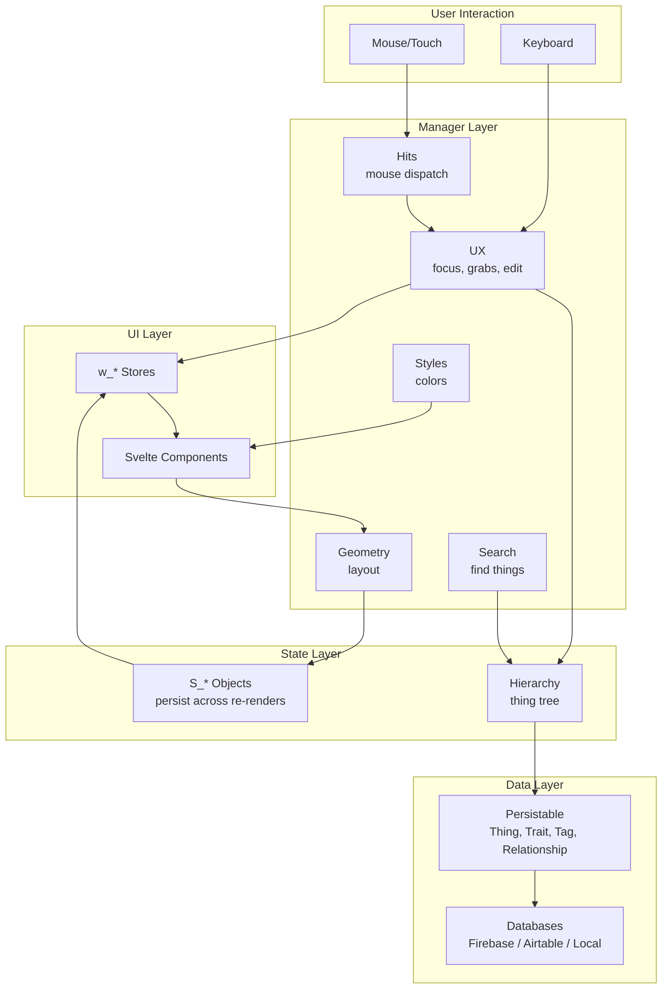

# Architecture Overview

Start here. This is how the pieces fit together.

## The Layers

**User Interaction** — Mouse and keyboard events enter here.

**UI Layer** — Svelte components render the interface. Stores (`w_*` writables) trigger reactivity.

**Manager Layer** — Singletons that coordinate domains. Hits dispatches mouse events. UX tracks focus and selection. Geometry computes layout. Styles computes colors. Search indexes content.

**State Layer** — `S_*` objects hold state that survives component re-renders. Hierarchy owns the tree of Things.

**Data Layer** — Persistable entities (Thing, Trait, Tag, Relationship) serialize to whichever database is active.

## Reading Order

1. [state.md](./architecture/core/state.md) — understand S_* objects and w_* stores
2. [managers.md](./architecture/core/managers.md) — the 16 singletons
3. [hits.md](./architecture/core/hits.md) — how mouse events flow
4. [ux.md](./architecture/core/ux.md) — focus, grabs, editing
5. [geometry.md](./architecture/core/geometry.md) — layout coordination

After that, pick what interests you.
